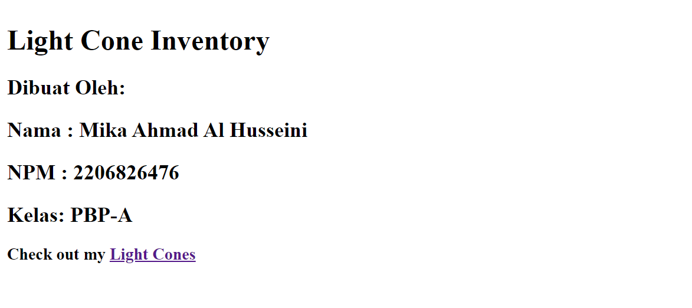

# PBP Ganjil 23/24 - Tugas 2

Ini merupakan solusi saya dari [Tugas 2 PBP Ganjil 23/24](https://pbp-fasilkom-ui.github.io/ganjil-2024/assignments/individual/assignment-2). Solusi ini dibuat oleh Mika Ahmad Al Husseini.

## Table of contents

- [Overview](#overview)
  - [Screenshots](#screenshots)
  - [Links](#links)
- [Questions and Answers](#questions-and-answers)
  - [Langkah Pengerjaan](#langkah-pengerjaan)
  - [Bagan Request Client](#bagan-request-client)
  - [Mengapa Virtual Environment?](#mengapa-virtual-environment)
  - [MVC, MVT, dan MVVM](#mvc-mvt-dan-mvvm)
- [Useful resources](#useful-resources)
- [Author](#author)

## Overview

### Screenshots

### Links

- GitHub URL: [GitHub](https://github.com/Archied10/hsr-lightcone-inventory)
- Adaptable App URL: [App](https://lightcone-archied10.adaptable.app/)

## Questions and Answers

### Langkah Pengerjaan
Jelaskan bagaimana cara kamu mengimplementasikan checklist di atas secara step-by-step (bukan hanya sekadar mengikuti tutorial).
- Sebelum saya membuat proyek Django baru, saya membuat dan mengaktifkan virtual environment agar dapat meng-install Django secara terpisah. Setelah itu, barulah saya meng-intall Django dan membuat proyek Django baru bernama hsr_lightcone_inventory. Setelah membuat proyek baru, saya mengizinkan akses dari semua host. Lalu, saya melakukan initial commit bersama dengan berkas .gitignore ke repositori yang sudah saya buat.
- Pada proyek ini, saya membuat aplikasi bernama main dan menambahkan main ke INSTALLED_APP pada settings.py di direktori proyek hsr_lightcone_inventory.
- Setelah itu, saya membuat dua berkas HTML di direktori templates, yaitu main.html yang berisikan tentang informasi personal dan aplikasi dan berkas lightcones.html untuk menampilkan informasi inventory.
- Pada aplikasi main, saya membuat model Item yang memiliki atribut name dan lc_path dengan tipe CharField, description dengan tipe TextField, dan amount, rarity, base_atk, base_hp, dan base_def dengan tipe IntegerField.
- Pada views.py, saya membuat dua fungsi. Fungsi pertama, yaitu main mengembalikan sebuah template yang berisikan nama aplikasi, nama saya, NPM, kelas, dan link menuju inventory. Fungsi kedua, yaitu lightcones mengembalikan sebuah template yang berisikan informasi terkait item pada inventory.
- Pada direktori main, saya membuat berkas urls.py. Di dalam berkas urls.py tersebut, saya membuat dua routing, yaitu '' yang dipetakan pada fungsi views.main dan 'lightcones/' yang dipetakan pada fungsi views.lightcones. Setelah itu, barulah saya melakukan routing pada proyek agar dapat menjalankan aplikasi main.
- Saya juga mengimplementasikan dua testing dasar, yaitu mengecek apakah dua kode HTML sama dan mengecek apakah terdapat text nama pada main.
- Setelah proyek selesai, saya melakukan push ke repositori dan melakukan deployment ke Adaptable dengan url https://lightcone-archied10.adaptable.app/.
- Setelah itu, saya membuat berkas README.md untuk menjawab soal pada Tugas 2 dan memberikan informasi terkait proyek yang saya buat.

### Bagan Request Client
Buatlah bagan yang berisi request client ke web aplikasi berbasis Django beserta responnya dan jelaskan pada bagan tersebut kaitan antara urls.py, views.py, models.py, dan berkas html.
- Berikut merupakan bagan tentang request client ke web aplikasi berbasis Django.
 
Digambar oleh <a href="https://github.com/Archied10">Archied10</a>. Terinspirasi dari <a href="https://scele.cs.ui.ac.id/mod/resource/view.php?id=149768">Slide 02 PBP</a>.

- Ketika user mengetikkan sebuah URL, request ke web aplikasi berbasis Django akan dicek di dalam urls.py. urls.py berfungsi untuk mengatur HTTP request yang diminta oleh user. Jika terdapat URL yang sesuai maka akan dipetakan ke fungsi yang sesuai di views.py. 
- views.py berfungsi untuk menangkap HTTP request dan mengembalikan HTTP response. Respons dari view dapat berupa webpage HTML, sebuah gambar, eror, ataupun yang lainnya. views.py dapat menjadi penghubung antara models.py dan berkas HTML di direktori templates.
- models.py akan menampung objek-objek yang mengandung informasi terkait data. Di dalam models.py, terdapat field dan sifat-sifat data yang disimpan. Umumnya, tiap model dipetakan ke satu tabel database. models.py akan berinteraksi secara langsung dengan database untuk membaca atau menulis data. Ketika berhasil membaca atau menulis data, models.py akan mengirimkan hasilnya kembali ke views.
- Setelah views.py mendapatkan hasil dari models.py, views.py akan menentukan untuk menggunakan Template yang mana, dapat berupa berkas HTML, CSS, dan JavaScript. Template tersebut akan mengatur layout pada webpage. 
- Setelah semua hal tersebut selesai, views.py akan mengembalikan HTTP Response ke user.

Referensi: [How Does Django Handle a Request?](https://pythonistaplanet.com/how-does-django-handle-a-request/#google_vignette) dan [How Django Works (MVT Pattern)](https://youtu.be/cyP4Uw2b2XM?si=iVh3rk5STdBx5Z4z)

### Mengapa Virtual Environment?
Jelaskan mengapa kita menggunakan virtual environment? Apakah kita tetap dapat membuat aplikasi web berbasis Django tanpa menggunakan virtual environment?
- Virtual environment digunakan agar kita dapat menggunakan versi python yang berbeda untuk tiap proyek. Virtual environment akan membuat lingkungan tersendiri di mana semua package dan versi yang di-install hanya berlaku pada virtual environment tersebut. Apa yang ada di dalam virtual environment tersebut tidak akan mempengaruhi proyek lainnya di luar virtual environment.
- Kita tetap dapat membuat aplikasi web berbasis Django tanpa menggunakan virtual environment, tetapi hal ini dapat menyebabkan disorganisasi. Jika tidak menggunakan virtual environment maka terdapat kemungkinan adanya package dan versi yang bertabrakan ketika meng-install sesuatu.

Referensi: [Why you should use a virtual environment for EVERY python project!](https://towardsdatascience.com/why-you-should-use-a-virtual-environment-for-every-python-project-c17dab3b0fd0)

### MVC, MVT, dan MVVM
Jelaskan apakah itu MVC, MVT, MVVM dan perbedaan dari ketiganya.
- MVC merupakan architectural pattern yang digunakan untuk mengimplementasikan user interface dan berfokus pada pemisahan antara logika penampilan data dengan komponen yang berinteraksi langsung dengan pemrosesan data. Terdapat tiga komponen pada MVC, yaitu Model, View, dan Controller. Model berfungsi untuk mengatur data pada proyek. View berfungsi untuk mengatur bagaimana data akan ditampilkan kepada user. Controller berfungsi untuk memanipulasi Model dan me-render View sehingga menjadi penghubung di antara keduanya. Contoh framework yang menggunakan MVC adalah Spring, Laravel, dan Yii.
- MVT merupakan architectural pattern yang hanya sedikit berbeda dengan MVC. MVT juga memiliki tiga komponen, yaitu Model, View, dan Template. Model merupakan komponen yang mirip pada MVC yang berfungsi sebagai antarmuka untuk data. View merupakan komponen yang berinteraksi dengan Model dan me-render template, menerima HTTP Request, dan mengembalikan HTTP Response. Template merupakan komponen yang membedakan MVC dengan MVT. Pada MVT, Template merupakan komponen yang mengatur bagaimana data ditampilkan ke user, sedangkan pada MVC, View yang menjalankan fungsi tersebut. Contoh framework yang menggunakan MVT adalah Django.
- Perbedaan lain MVC dengan MVT adalah MVC mempunyai Controller yang mengatur Model dan View, sedangkan MVT mempunyai View untuk menerima HTTP Request dan mengembalikan HTTP Response. MVC tidak perlu untuk melakukan pemetaan URL, sedangkan MVT perlu untuk melakukan hal tersebut. Pada MVC, kita harus menulis kode terkait Controller, sedangkan pada MVT, Controller diatur oleh framework itu sendiri.
- MVVM merupakan architectural pattern yang berfokus pada pemisahan antara logika penampilan data dengan logika bisnis. Terdapat tiga komponen pada MVVM, yaitu Model, View, dan ViewModel. Model merupakan komponen yang bertanggung jawab atas abstraksi dari sumber data. Model dan ViewModel bekerja sama untuk mendapatkan dan menyimpan data tersebut. View berfungsi untuk mengobservasi ViewModel dan memberi tahu ViewModel tentang aksi yang dilakukan user. View tidak memiliki logika aplikasi. ViewModel berfungsi untuk mengkonversi objek data dari Model sedemikian rupa sehingga data tersebut dapat dengan mudah diatur dan ditampilkan. Data yang relevan akan diberikan kepada View. Jadi, ViewModel berperan sebagai penghubung antara Model dan View. Contoh framework yang menggunakan MVVM adalah Flutter.
- Perbedaan MVVM dengan MVC dan MVT adalah View pada MVVM berperan untuk menerima input dari user dan berperan sebagai titik masuk dari aplikasi. Pada MVVM, beberapa View dapat dipetakan oleh satu ViewModel dan View mengetahui apa yang ada di dalam ViewModel, sedangkan pada MVC, View tidak mengetahui apa yang ada di dalam Controller. MVVM juga lebih baik dalam melakukan unit testing daripada MVC dan MVT.

Referensi: [Difference between MVC and MVT design patterns](https://www.geeksforgeeks.org/difference-between-mvc-and-mvt-design-patterns/) dan [Difference Between MVC and MVVM Architecture Pattern in Android](https://www.geeksforgeeks.org/difference-between-mvc-and-mvvm-architecture-pattern-in-android/)

## Useful resources

- [W3Schools](https://www.w3schools.com) - Website ini membantu saya untuk belajar Django, HTML, dan CSS.
- [Stack Overflow](https://stackoverflow.com/) - Website ini membantu saya ketika kode saya mengalami eror.

## Author

- Website - [Archied10](https://github.com/Archied10)