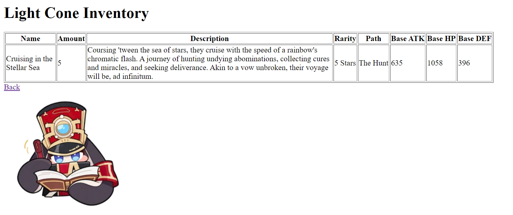

# PBP Ganjil 23/24 - Tugas 2

Ini merupakan solusi saya dari [Tugas 2 PBP Ganjil 23/24](https://pbp-fasilkom-ui.github.io/ganjil-2024/assignments/individual/assignment-2). Solusi ini dibuat oleh Mika Ahmad Al Husseini.

## Table of contents

- [Overview](#overview)
  - [Screenshot](#screenshot)
  - [Links](#links)
- [Questions](#questions)
  - [Langkah Pengerjaan](#langkah-pengerjaan)
  - [Bagan Request Client](#bagan-request-client)
  - [Mengapa Virtual Environment?](#mengapa-virtual-environment?)
  - [MVC, MVT, dan MVVM](#mvc,-mvt,-dan-mvvm)
- [Useful resources](#useful-resources)
- [Author](#author)

## Overview

### Screenshot

### Links

- GitHub URL: [GitHub](https://github.com/Archied10/hsr-lightcone-inventory)
- Adaptable App URL: [App](https://lightcone-archied10.adaptable.app/)

## Questions

### Langkah Pengerjaan
-

### Bagan Request Client
-

### Mengapa Virtual Environment?
-

### MVC, MVT, dan MVVM
-

## Useful resources

- [W3Schools](https://www.w3schools.com) - Website ini membantu saya untuk belajar Django, HTML, dan CSS.
- [Stack Overflow](https://stackoverflow.com/) - Website ini membantu saya ketika kode saya mengalami eror.

## Author

- Website - [Archied10](https://github.com/Archied10)