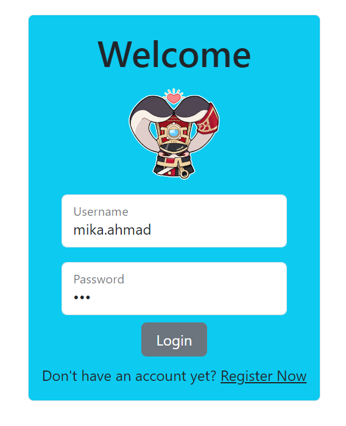

# PBP Ganjil 23/24 - Tugas

Ini merupakan solusi saya dari [Tugas PBP Ganjil 23/24](https://pbp-fasilkom-ui.github.io/ganjil-2024/assignments). Solusi ini dibuat oleh Mika Ahmad Al Husseini.

## Table of Contents

- [Overview](#overview)
  - [Screenshots](#screenshots)
  - [Links](#links)
- [Questions and Answers Tugas 2](#questions-and-answers-tugas-2)
  - [Langkah Pengerjaan II](#langkah-pengerjaan-ii)
  - [Bagan Request Client](#bagan-request-client)
  - [Mengapa Virtual Environment?](#mengapa-virtual-environment)
  - [MVC, MVT, dan MVVM](#mvc-mvt-dan-mvvm)
- [Questions and Answers Tugas 3](#questions-and-answers-tugas-3)
  - [Form POST dan Form GET](#form-post-dan-form-get)
  - [XML, JSON, dan HTML](#xml-json-dan-html)
  - [JSON pada Aplikasi Web Modern](#json-pada-aplikasi-web-modern)
  - [Langkah Pengerjaan III](#langkah-pengerjaan-iii)
  - [Postman Screenshots](#postman-screenshots)
- [Questions and Answers Tugas 4](#questions-and-answers-tugas-4)
  - [UserCreationForm](#usercreationform)
  - [Autentikasi dan Otorisasi](#autentikasi-dan-otorisasi)
  - [Cookies dalam Aplikasi Web](#cookies-dalam-aplikasi-web)
  - [Cookies: Apakah Aman?](#cookies-apakah-aman)
  - [Langkah Pengerjaan IV](#langkah-pengerjaan-iv)
- [Questions and Answers Tugas 5](#questions-and-answers-tugas-5)
  - [Element Selector](#element-selector)
  - [HTML5 Tag](#html5-tag)
  - [Margin dan Padding](#margin-dan-padding)
  - [Tailwind dan Bootstrap](#tailwind-dan-bootstrap)
  - [Langkah Pengerjaan V](#langkah-pengerjaan-v)
- [Questions and Answers Tugas 6](#questions-and-answers-tugas-6)
  - [Asynchronous dan Synchronous Programming](#asynchronous-dan-synchronous-programming)
  - [Event-driven Programming](#event-driven-programming)
  - [Asynchronous Programming pada AJAX](#asynchronous-programming-pada-ajax)
  - [Fetch API dan Library jQuery](#fetch-api-dan-library-jquery)
  - [Langkah Pengerjaan VI](#langkah-pengerjaan-vi)
- [Useful resources](#useful-resources)
- [Author](#author)

## Overview

### Screenshots

### Links

- GitHub URL: [GitHub](https://github.com/Archied10/hsr-lightcone-inventory)
- Adaptable App URL: [Adaptable](https://lightcone-archied10.adaptable.app/) *(No longer adaptable)*
- PBP Fasilkom UI App URL: [App](http://mika-ahmad-tugas.pbp.cs.ui.ac.id/)

## Questions and Answers Tugas 2

### Langkah Pengerjaan II
Jelaskan bagaimana cara kamu mengimplementasikan checklist di atas secara step-by-step (bukan hanya sekadar mengikuti tutorial).
- Sebelum saya membuat proyek Django baru, saya membuat dan mengaktifkan virtual environment agar dapat meng-install Django secara terpisah. Setelah itu, barulah saya meng-intall Django dan membuat proyek Django baru bernama `hsr_lightcone_inventory`. Setelah membuat proyek baru, saya mengizinkan akses dari semua host. Lalu, saya melakukan initial commit bersama dengan berkas `.gitignore` ke repositori yang sudah saya buat.
- Pada proyek ini, saya membuat aplikasi bernama main dan menambahkan main ke `INSTALLED_APP` pada `settings.py` di direktori proyek `hsr_lightcone_inventory`.
- Setelah itu, saya membuat dua berkas HTML di direktori templates, yaitu `main.html` yang berisikan tentang informasi personal dan aplikasi dan berkas `lightcones.html` untuk menampilkan informasi inventory.
- Pada aplikasi main, saya membuat model Item yang memiliki atribut `name` dan `lc_path` dengan tipe `CharField`, `description` dengan tipe `TextField`, dan `amount`, `rarity`, `base_atk`, `base_hp`, dan `base_def` dengan tipe `IntegerField`.
- Pada `views.py`, saya membuat dua fungsi. Fungsi pertama, yaitu `main` mengembalikan sebuah template yang berisikan nama aplikasi, nama saya, NPM, kelas, dan link menuju inventory. Fungsi kedua, yaitu `lightcones` mengembalikan sebuah template yang berisikan informasi terkait item pada inventory.
- Pada direktori main, saya membuat berkas urls.py. Di dalam berkas urls.py tersebut, saya membuat dua routing, yaitu `''` yang dipetakan pada fungsi `views.main` dan `'lightcones/'` yang dipetakan pada fungsi `views.lightcones`. Setelah itu, barulah saya melakukan routing pada proyek agar dapat menjalankan aplikasi `main`.
- Saya juga mengimplementasikan dua testing dasar, yaitu mengecek apakah dua kode HTML sama dan mengecek apakah terdapat text nama pada `main`.
- Setelah proyek selesai, saya melakukan push ke repositori dan melakukan deployment ke Adaptable dengan url https://lightcone-archied10.adaptable.app/.
- Setelah itu, saya membuat berkas `README.md` untuk menjawab soal pada Tugas 2 dan memberikan informasi terkait proyek yang saya buat.

### Bagan Request Client
Buatlah bagan yang berisi request client ke web aplikasi berbasis Django beserta responnya dan jelaskan pada bagan tersebut kaitan antara urls.py, views.py, models.py, dan berkas html.
- Berikut merupakan bagan tentang request client ke web aplikasi berbasis Django.
 
Digambar oleh <a href="https://github.com/Archied10">Archied10</a>. Terinspirasi dari <a href="https://scele.cs.ui.ac.id/mod/resource/view.php?id=149768">Slide 02 PBP</a>.

- Ketika user mengetikkan sebuah URL, request ke web aplikasi berbasis Django akan dicek di dalam `urls.py`. `urls.py` berfungsi untuk mengatur HTTP request yang diminta oleh user. Jika terdapat URL yang sesuai maka akan dipetakan ke fungsi yang sesuai di `views.py`. 
- `views.py` berfungsi untuk menangkap HTTP request dan mengembalikan HTTP response. Respons dari view dapat berupa webpage HTML, sebuah gambar, eror, ataupun yang lainnya. `views.py` dapat menjadi penghubung antara `models.py` dan berkas HTML di direktori templates.
- `models.py` akan menampung objek-objek yang mengandung informasi terkait data. Di dalam `models.py`, terdapat field dan sifat-sifat data yang disimpan. Umumnya, tiap model dipetakan ke satu tabel database. `models.py` akan berinteraksi secara langsung dengan database untuk membaca atau menulis data. Ketika berhasil membaca atau menulis data, `models.py` akan mengirimkan hasilnya kembali ke views.
- Setelah `views.py` mendapatkan hasil dari `models.py`, `views.py` akan menentukan untuk menggunakan Template yang mana, dapat berupa berkas HTML, CSS, dan JavaScript. Template tersebut akan mengatur layout pada webpage. 
- Setelah semua hal tersebut selesai, `views.py` akan mengembalikan HTTP Response ke user.

Referensi: [How Does Django Handle a Request?](https://pythonistaplanet.com/how-does-django-handle-a-request/#google_vignette) dan [How Django Works (MVT Pattern)](https://youtu.be/cyP4Uw2b2XM?si=iVh3rk5STdBx5Z4z)

### Mengapa Virtual Environment?
Jelaskan mengapa kita menggunakan virtual environment? Apakah kita tetap dapat membuat aplikasi web berbasis Django tanpa menggunakan virtual environment?
- Virtual environment digunakan agar kita dapat menggunakan versi python yang berbeda untuk tiap proyek. Virtual environment akan membuat lingkungan tersendiri di mana semua package dan versi yang di-install hanya berlaku pada virtual environment tersebut. Apa yang ada di dalam virtual environment tersebut tidak akan mempengaruhi proyek lainnya di luar virtual environment.
- Kita tetap dapat membuat aplikasi web berbasis Django tanpa menggunakan virtual environment, tetapi hal ini dapat menyebabkan disorganisasi. Jika tidak menggunakan virtual environment maka terdapat kemungkinan adanya package dan versi yang bertabrakan ketika meng-install sesuatu.

Referensi: [Why you should use a virtual environment for EVERY python project!](https://towardsdatascience.com/why-you-should-use-a-virtual-environment-for-every-python-project-c17dab3b0fd0)

### MVC, MVT, dan MVVM
Jelaskan apakah itu MVC, MVT, MVVM dan perbedaan dari ketiganya.
- MVC merupakan architectural pattern yang digunakan untuk mengimplementasikan user interface dan berfokus pada pemisahan antara logika penampilan data dengan komponen yang berinteraksi langsung dengan pemrosesan data. Terdapat tiga komponen pada MVC, yaitu Model, View, dan Controller. Model berfungsi untuk mengatur data pada proyek. View berfungsi untuk mengatur bagaimana data akan ditampilkan kepada user. Controller berfungsi untuk memanipulasi Model dan me-render View sehingga menjadi penghubung di antara keduanya. Contoh framework yang menggunakan MVC adalah Spring, Laravel, dan Yii.
- MVT merupakan architectural pattern yang hanya sedikit berbeda dengan MVC. MVT juga memiliki tiga komponen, yaitu Model, View, dan Template. Model merupakan komponen yang mirip pada MVC yang berfungsi sebagai antarmuka untuk data. View merupakan komponen yang berinteraksi dengan Model dan me-render template, menerima HTTP Request, dan mengembalikan HTTP Response. Template merupakan komponen yang membedakan MVC dengan MVT. Pada MVT, Template merupakan komponen yang mengatur bagaimana data ditampilkan ke user, sedangkan pada MVC, View yang menjalankan fungsi tersebut. Contoh framework yang menggunakan MVT adalah Django.
- Perbedaan lain MVC dengan MVT adalah MVC mempunyai Controller yang mengatur Model dan View, sedangkan MVT mempunyai View untuk menerima HTTP Request dan mengembalikan HTTP Response. MVC tidak perlu untuk melakukan pemetaan URL, sedangkan MVT perlu untuk melakukan hal tersebut. Pada MVC, kita harus menulis kode terkait Controller, sedangkan pada MVT, Controller diatur oleh framework itu sendiri.
- MVVM merupakan architectural pattern yang berfokus pada pemisahan antara logika penampilan data dengan logika bisnis. Terdapat tiga komponen pada MVVM, yaitu Model, View, dan ViewModel. Model merupakan komponen yang bertanggung jawab atas abstraksi dari sumber data. Model dan ViewModel bekerja sama untuk mendapatkan dan menyimpan data tersebut. View berfungsi untuk mengobservasi ViewModel dan memberi tahu ViewModel tentang aksi yang dilakukan user. View tidak memiliki logika aplikasi. ViewModel berfungsi untuk mengkonversi objek data dari Model sedemikian rupa sehingga data tersebut dapat dengan mudah diatur dan ditampilkan. Data yang relevan akan diberikan kepada View. Jadi, ViewModel berperan sebagai penghubung antara Model dan View. Contoh framework yang menggunakan MVVM adalah Flutter.
- Perbedaan MVVM dengan MVC dan MVT adalah View pada MVVM berperan untuk menerima input dari user dan berperan sebagai titik masuk dari aplikasi. Pada MVVM, beberapa View dapat dipetakan oleh satu ViewModel dan View mengetahui apa yang ada di dalam ViewModel, sedangkan pada MVC, View tidak mengetahui apa yang ada di dalam Controller. MVVM juga lebih baik dalam melakukan unit testing daripada MVC dan MVT.

Referensi: [Difference between MVC and MVT design patterns](https://www.geeksforgeeks.org/difference-between-mvc-and-mvt-design-patterns/) dan [Difference Between MVC and MVVM Architecture Pattern in Android](https://www.geeksforgeeks.org/difference-between-mvc-and-mvvm-architecture-pattern-in-android/)

## Questions and Answers Tugas 3

### Form POST dan Form GET
Apa perbedaan antara form `POST` dan form `GET` dalam Django?
- `POST` merupakan method HTTP request yang digunakan untuk mengirim data ke server. Jika berhasil maka `POST` akan mengembalikan HTTP status code 201. Jadi, semua request yang dapat mengubah sistem, seperti mengubah database sebaiknya menggunakan `POST`. `POST` lebih aman dibandingkan `GET` karena `POST` mengirimkan data ke server web menggunakan HttpPost. `POST` mengirimkan data secara internal sehingga tidak akan terlihat pada parameter URL. Jika `POST` digunakan bersama CSRF protection maka `POST` akan lebih aman lagi. `POST` lebih cocok untuk mengirim data yang sensitif, seperti password dan data yang panjang.
- `GET` merupakan method HTTP request yang digunakan untuk membaca atau mengambil data dari server web. Jika berhasil maka `GET` akan mengembalikan HTTP status code 200. `GET` sebaiknya digunakan untuk request yang tidak mengubah sistem. `GET` kurang aman dibandingkan `POST` karena `GET` mengirimkan data ke server web menggunakan parameter URL sehingga tidak cocok jika digunakan untuk mengirim password. `GET` lebih cocok untuk digunakan pada form pencarian web karena URL yang merepresentasikan request `GET` akan lebih mudah untuk disimpan atau di-share ke orang lain.

Referensi: [Slide 04 PBP](https://scele.cs.ui.ac.id/pluginfile.php/194455/mod_resource/content/2/Slides%2004%20-%20Data%20Delivery.pdf), [What is Difference between GET Method and Post Method in Django Form?](https://www.shivatutorials.com/2020/02/create-html-form-in-django.html), dan [Working with forms](https://docs.djangoproject.com/en/4.2/topics/forms/#:~:text=Django's%20login%20form%20is%20returned,this%20to%20compose%20a%20URL.)

### XML, JSON, dan HTML
Apa perbedaan utama antara XML, JSON, dan HTML dalam konteks pengiriman data?
- XML (eXtensible Markup Language) merupakan metalanguage yang digunakan untuk menggambarkan vocabularies. XML merupakan *markup language* yang menyimpan data dalam bentuk tag. XML berdasar dari Standard Generalised Markup Language (SGML) sehingga sangat mirip dengan HTML. Komen dapat dituliskan pada XML, sedangkan JSON tidak bisa.
- JSON (JavaScript Object Notation) merupakan format data yang tidak bergantung pada bahasa pemrogaraman tertentu yang merepresentasikan objek JSON yang dapat dengan mudah dibaca dalam bentuk pasangan name-value mirip dictionary pada Python. JSON berdasar pada bahasa JavaScript. JSON dapat memiliki jumlah karakter yang lebih sedikit dari XML karena tidak memerlukan end tag dan lebih mudah untuk di-parse.
- HTML (HyperText Markup Language) merupakan *markup language* yang digunakan oleh browser web untuk menginterpretasikan teks, gambar, dan lainnya ke halaman web. HTML merupakan aplikasi dari SGML sehingga menggunakan tag. Sebenarnya, HTML bukan dirancang untuk mengirim data, tetapi sebagai layout untuk menampilkan data pada halaman web.

Referensi: [What’s the Relationship Between XML, JSON, HTML and the Internet?](https://www.deltaxml.com/blog/xml/whats-the-relationship-between-xml-json-html-and-the-internet/#top) dan [Java XML and JSON](https://link.springer.com/book/10.1007/978-1-4842-1916-4)

### JSON pada Aplikasi Web Modern
Mengapa JSON sering digunakan dalam pertukaran data antara aplikasi web modern?
- Sintaks pasangan name-value yang digunakan JSON mudah dibaca oleh manusia dan komputer.
- JSON merupakan format data yang optimal, hanya memakan sedikit memori pada aplikasi. 
- JSON kompatibel dengan banyak bahasa pemrograman, framework, sistem operasi, dan browser yang bisa langsung menggunakan JSON.
- JSON merupakan format data yang berbasis teks dan mudah untuk di-parse dan tidak membutuhkan kode tambahan untuk melakukan parsing.

Referensi: [The power of JSON: what's behind the popularity?](https://brandmed.com/blog/development/the-power-of-json-whats-behind-the-popularity) dan [What is JSON? | Oracle](https://www.oracle.com/id/database/what-is-json/)

### Langkah Pengerjaan III
Jelaskan bagaimana cara kamu mengimplementasikan checklist di atas secara step-by-step (bukan hanya sekadar mengikuti tutorial).
- Sebelum saya memulai tugas, saya membuat template dasar, yaitu `base.html` sebagai kerangka umum untuk halaman web lainnya. Lalu, pada `settings.py` saya menambahkan kode pada `TEMPLATES` agar `base.html` terdeteksi sebagai berkas template.
- Setelah itu, barulah saya membuat berkas `forms.py` pada direktori `main`. Saya menunjuk `Item` sebagai model yang digunakan untuk form. Saya juga menunjuk beberapa `field` dari `Item` yang digunakan untuk form, yaitu `name`, `amount`, `description`, `rarity`, `lc_path`, `base_atk`, `base_hp`, `base_def`. Setelah itu, saya membuat fungsi pada `views.py`, yaitu `create_item()` dan berkas `create_item.html` untuk membuat formulir yang digunakan agar user dapat menambahkan item.
- Saya menambahkan button pada `lightcones.html` untuk mengarah pada halaman web form untuk menambahkan item. Pada `lightcones.html` saya juga menampilkan seluruh item yang sudah ditambahkan oleh user.
- Selanjutnya, saya membuat empat fungsi pada `views.py`, yaitu `show_xml()`, `show_json()`, `show_xml_by_id()`, dan `show_json_by_id()` untuk mengembalikan data. Tiap fungsi mengembalikan HttpResponse yang berisi parameter data hasil query yang sudah diserialisasi sesuai format data. Lalu, pada `urls.py`, saya mengimport masing-masing fungsi dan menambahkan path url masing-masing fungsi ke dalam `urlpatterns`.
- Terakhir, pada fungsi `lightcones()` di `views.py` saya menambahkan algoritma untuk menghitung seluruh item pada inventory dan ditampilkan di halaman web.

### Postman Screenshots
- HTML

- XML

- JSON

- XML by ID

- JSON by ID

## Questions and Answers Tugas 4

### UserCreationForm
Apa itu Django UserCreationForm, dan jelaskan apa kelebihan dan kekurangannya?
- Django mempunyai sistem autentikasi bawaan yang bertugas untuk memvalidasi password dan permission. Tentunya perlu suatu fitur untuk membuat user yang dapat menggunakan aplikasi web. `UserCreationForm` merupakan fitur bawaan dari class `ModelForm` pada Django dan digunakan untuk membuat form pengguna baru. `UserCreationForm` diimpor dari `django.contrib.auth.forms`. `UserCreationForm` dapat dengan otomatis membuat form untuk membuat user dengan tiga field, yaitu nama, password, dan konfirmasi password. Akan tetapi, `UserCreationForm` hanya dapat menyediakan ketiga field tersebut. Oleh karena itu, ketika kita ingin mengirim verifikasi email untuk memverifikasi user, kita tidak bisa melakukannya karena `UserCreationForm` tidak menyediakan field email. Untuk mengatasi hal tersebut, kita dapat memodifikasi `UserCreationForm` agar dapat menambahkan field-field yang tidak disediakan.

Referensi: [Working with Forms in Django](https://www.section.io/engineering-education/working-with-forms-in-django/) dan [Django UserCreationForm](https://www.javatpoint.com/django-usercreationform)

### Autentikasi dan Otorisasi
Apa perbedaan antara autentikasi dan otorisasi dalam konteks Django, dan mengapa keduanya penting?
- Sistem autentikasi pada Django mengatur autentikasi dan otorisasi. Autentikasi memverifikasi user yang ingin login ke dalam aplikasi web dan otorisasi akan menentukan apa yang dapat dilakukan oleh user yang telah diautentikasi. Autentikasi pada Django penting karena dapat menyimpan user dan menyimpan password user dalam bentuk hash. Autentikasi dapat memverifikasi username dan password dan mengembalikan objek `User` jika username dan passwordnya valid pada backend autentikasi. Otorisasi pada Django penting karena dapat menetapkan permission pada user. Contohnya, mengakses untuk melihat suatu objek diperlukan permission `view` atau `change`, melihat form `add` dan menambahkan objek diperlukan permission `add`, melihat form `change` dan mengubah objek diperlukan permission `change`, dan menghapus objek diperlukan permission `delete`.

Referensi: [User authentication in Django](https://docs.djangoproject.com/en/4.2/topics/auth/) dan [Using the Django authentication system](https://docs.djangoproject.com/en/4.2/topics/auth/default/#topic-authorization)

### Cookies dalam Aplikasi Web
Apa itu cookies dalam konteks aplikasi web, dan bagaimana Django menggunakan cookies untuk mengelola data sesi pengguna?
- Cookies merupakan berkas teks dengan ukuran data yang kecil yang dapat mengandung hal-hal seperti username dan password yang digunakan untuk mengidentifikasi komputer ketika menggunakan suatu jaringan. Terdapat cookies khusus untuk mengidentifikasi user spesifik agar dapat meningkatkan pengalaman web browsing. Data yang disimpan pada cookies dibuat oleh server ketika komputer terkoneksi ke jaringan. Data ini akan diberi label ID yang unik untuk komputer pengguna. Ketika cookies diberikan dari komputer ke jaringan server, server akan membaca ID dan memberikan informasi yang spesifik untuk pengguna.
- Django menyediakan method bawaan untuk mengatur dan memperoleh cookies. Method `set_cookie()` digunakan untuk mengatur cookie dan method `get()` digunakan untuk memperoleh cookie. Dengan menggunakan `set_cookie()`, pengguna dapat mengatur nama cookie, nilai cookie, maksimal umur cookie, tanggal expire cookie, mengirim cookie hanya ketika request berupa HTTPS, JavaScript sisi client tidak dapat mengakses cookie, dan mengizinkan cookie untuk dikirim ke request pada situs yang sama. Cookie dapat dihapus menggunakan method `delete_cookie()`. Untuk mengakses seluruh cookies yang dikirimkan oleh web browser, pengguna dapat menggunakan properti `COOKIES` pada objek `HttpRequest`. Method `get()` dapat digunakan untuk mengakses dictionary pada `COOKIES`.

Referensi: [What are Cookies?](https://www.kaspersky.com/resource-center/definitions/cookies), [Django Cookie](https://www.javatpoint.com/django-cookie), dan [Django Cookies](https://www.pythontutorial.net/django-tutorial/django-cookies/)

### Cookies: Apakah Aman?
Apakah penggunaan cookies aman secara default dalam pengembangan web, atau apakah ada risiko potensial yang harus diwaspadai?
- Pada umumnya, penggunaan cookies akan sangat aman ketika diimplementasikan dengan tepat. Akan tetapi, terdapat beberapa hal yang harus diwaspadai. Seorang kriminal dapat mencuri cookies dan menyebabkan banyak kerugian. 
- Contohnya adalah seperti serangan Man-in-the-middle (MitM). MitM merupakan serangan dimana penyerang akan menghadang data yang dikirimkan antara client dan server. Hal ini dapat dilakukan dengan berbagai cara, seperti mengakses website yang tidak aman, meniru WIFI publik, hingga melalui malware. 
- Contoh lainnya adalah serangan XSS, yaitu penyerang menginjeksi kode yang berbahaya pada website. Serangan ini dapat merugikan semua orang yang mengakses website tersebut. Jika suatu penyerang berhasil melakukan serangan XSS pada website maka akan memungkinkan penyerang untuk mendapatkan akses ke session cookies dan dapat mengakses website sebagai user lain. 
- Serangan-serangan yang sudah disebutkan di atas dapat dihindari dengan cara mengizinkan HTTPS pada server, menggunakan sertifikat SSL dari otoritas yang terpercaya, dan pastikan kode program menggunakan HTTPS bukan HTTP yang tidak aman.

Referensi: [Everything You Need to Know About Cookies for Web Development](https://www.freecodecamp.org/news/everything-you-need-to-know-about-cookies-for-web-development/)

### Langkah Pengerjaan IV
Jelaskan bagaimana cara kamu mengimplementasikan checklist di atas secara step-by-step (bukan hanya sekadar mengikuti tutorial).
- Pada `views.py`, saya membuat tiga fungsi, yaitu `register()`, `login_user()`, dan `logout_user()`. Fungsi `register()` mengandung fitur UserCreationForm untuk dapat membuat user yang baru. Fungsi `login_user()` akan mengautentikasi username dan password yang dimasukkan oleh user dan jika berhasil akan mengatur cookie dan menuju `show_main`. Pada fungsi `show_main()` ditambahkan `@login_required(login_url='/login')` agar hanya bisa diakses ketika user sudah login. Fungsi `logout_user()` akan menghapus cookie dan kembali ke halaman login. Masing-masing fungsi diimpor ke `urls.py` dan ditambahkan pathnya.
- Selanjutnya, saya membuat dua akun dengan username **mika.ahmad** dan **archied10**. Pada tiap akun, saya setidaknya menambahkan tiga item yang berbeda-beda pada inventory. 
- Pada `models.py`, saya menambahkan kode yang akan menghubungkan satu produk dengan satu user. Pada fungsi `create_item()`, saya menambahkan kode agar suatu item dapat ditandai bahwa item tersebut dimiliki oleh user yang sedang terotorisi. Pada fungsi `show_main()`, saya memfilter item agar hanya item yang dimiliki oleh user yang terotorisasi yang akan ditampilkan dan juga mengubah nama yang akan ditampilkan menjadi username dari user. Terakhir, saya menyimpan perubahan dan melakukan migrasi model.
- Cookie yang sudah diatur pada fungsi `login_user()`, yaitu berupa last login ditampilkan pada `main.html`.
- Terakhir, saya menambahkan kolom baru pada tabel di berkas `lightcones.html`. Kolom pertama berisikan button yang berfungsi untuk mengupdate nilai amount item (menambahkan dan mengurangkan) dan kolom kedua berfungsi untuk menghapus item. Saya membuat masing-masing satu fungsi pada `views.py` untuk tiap button, yaitu `increase_amount()`, `decrease_amount()`, dan `delete_item()`. Masing-masing fungsi diimpor ke `urls.py` dan ditambahkan pathnya. Fungsi tersebut berfungsi untuk memodifikasi nilai pada database dan ketika berhasil akan mengembalikan `HttpResponse`.

## Questions and Answers Tugas 5

### Element Selector
Jelaskan manfaat dari setiap element selector dan kapan waktu yang tepat untuk menggunakannya.

- **#id**. Contohnya adalah `#nama`. Digunakan untuk memilih elemen dengan id yang ditentukan, misalnya `id="nama"`. Waktu yang tepat untuk menggunakannya adalah ketika ingin memilih elemen dengan id tertentu untuk di-*style*.
- **.class**. Contohnya adalah `.buku`. Digunakan untuk memilih elemen dengan class yang ditentukan, misalnya `class="buku"`. Waktu yang tepat untuk menggunakannya adalah ketika ingin memilih elemen dengan class tertentu untuk di-*style*.
- **element.class**. Contohnya adalah `div.buku`. Digunakan untuk memilih elemen dengan tag tertentu dan dengan class tertentu, misalnya memilih elemen `
` dengan `class="buku"`. Waktu yang tepat untuk menggunakannya adalah ketika ingin memilih elemen dengan tag tertentu dan dengan class tertentu.
- **\***. Contohnya adalah `*`. Digunakan untuk memilih seluruh elemen. Waktu yang tepat untuk menggunakannya adalah ketika ingin seluruh elemen memiliki *style* yang sama.
- **element**. Contohnya adalah `div`. Digunakan untuk memilih seluruh elemen dengan tag tertentu, misalnya memilih seluruh tag `
`. Waktu yang tepat untuk menggunakannya adalah ketika ingin seluruh elemen dengan tag tertentu mempunyai *style* yang seragam.
- **element,element,...**. Contohnya adalah `div, p`. Digunakan untuk memilih seluruh elemen dengan beberapa tag tertentu, misalnya elemen dengan tag `
` dan tag `
`. Waktu yang tepat untuk menggunakannya adalah ketika ingin seluruh elemen dengan beberapa tag tertentu mempunyai *style* yang seragam.

Referensi: [CSS Selectors](https://www.w3schools.com/css/css_selectors.asp)

### HTML5 Tag
Jelaskan HTML5 Tag yang kamu ketahui.

Terdapat banyak sekali tag pada HTML5. Berikut merupakan sepuluh contoh tag yang diperkenalkan di HTML5.
- `<article>` digunakan untuk mendefinisikan sebuah konten pada dokumen, seperti blog, majalah, atau koran.
- `<audio>` digunakan untuk menjalankan berkas audio di HTML.
- `<footer>` digunakan untuk mendefinisikan footer untuk sebuah section.
- `<figure>` digunakan untuk menyisipkan konten, seperti foto, diagram, dan lainnya.
- `<figcaption>` digunakan untuk mendefinisikan caption untuk elemen dengan tag `<figure>`.
- `<header>` digunakan untuk mendefinisikan header untuk sebuah section.
- `<main>` digunakan untuk mendefinisikan konten utama pada dokumen.
- `<nav>` digunakan untuk mendifinisikan link navigasi pada dokumen.
- `<time>` digunakan untuk mendefinisikan tanggal atau waktu.
- `<video>` digunakan untuk menjalankan video pada berkas HTML.

Referensi: [HTML 5 Tags](https://www.javatpoint.com/html-5-tags) 

### Margin dan Padding
Jelaskan perbedaan antara margin dan padding.
- **Margin** merupakan ruang yang ada di sekitar elemen dan digunakan untuk memindahkan elemen ke atas, bawah, kanan, ataupun kiri. Margin tidak memiliki warna background dan transparan. Tiap sisi dari elemen dapat diubah marginnya. Margin mendorong elemen yang bersebelahan untuk membuat celah. 
- **Padding** merupakan ruang yang ada di antara elemen dengan konten yang ada di dalam elemen. Padding menentukan bagaimana elemen terlihat. Padding dapat dipengaruhi oleh warna background karena menghapus area sekitar konten. Untuk membuat celah, padding dapat memperbesar ukuran elemen ataupun mengecilkan ukuran elemen.
- Margin merupakan ruang di luar elemen, sedangkan padding merupakan ruang di dalam elemen. Margin dapat berupa nilai negatif, sedangkan padding tidak. Margin dapat diatur menjadi auto untuk menengahkan elemen secara horizontal, sedangkan padding tidak.

Referensi: [CSS Padding vs Margin](https://www.geeksforgeeks.org/css-padding-vs-margin/)

### Tailwind dan Bootstrap
Jelaskan perbedaan antara framework CSS Tailwind dan Bootstrap. Kapan sebaiknya kita menggunakan Bootstrap daripada Tailwind, dan sebaliknya?
- **Tailwind CSS** dikembangkan oleh Adam Wathan. Tailwind CSS adalah framework CSS yang bersifat utility-first dan low-level. Tailwind menawarkan kelas-kelas single-purpose yang dapat digunakan langsung dalam halaman web untuk memberikan *style* pada elemen. Tailwind memungkinkan para pengembang untuk dengan cepat membuat antarmuka pengguna yang disesuaikan.
- **Bootstrap** adalah framework CSS yang open-source dan gratis untuk membuat aplikasi web responsif dan mobile. Bootstrap adalah framework pengembangan front end yang berfokus pada mobile-first. Bootstrap berisikan template HTML, CSS, dan JavaScript untuk berbagai komponen. Bootstrap dikembangkan oleh Mark Otto dan Jacob Thorton. 
- Kita dapat menggunakan Tailwind ketika kita menginginkan ukuran file yang optimal dan ketika kita ingin lebih fleksibel dalam merancang layout. Boostrap dapat digunakan ketika ingin bekerja dalam tim karena memberikan desain yang konsisten dan digunakan ketika ingin membuat halaman web dengan cepat karena Bootstrap memiliki banyak komponen yang siap pakai.

Referensi: [Tailwind CSS Vs Bootstrap](https://www.tutorialspoint.com/tailwind-css-vs-bootstrap)

### Langkah Pengerjaan V
Jelaskan bagaimana cara kamu mengimplementasikan checklist di atas secara step-by-step (bukan hanya sekadar mengikuti tutorial).
- Hal pertama yang saya lakukan adalah menambahkan Bootstrap ke aplikasi. 
- Selanjutnya, saya memberi *style* pada halaman login, register, dan tambah item. Saya menggunakan floating label untuk input. Saya menggunakan padding untuk mengatur ukuran button dan margin untuk mengatur jarak antar elemen. Pada halaman register dan tambah item, saya menggunakan widget_tweaks untuk memberikan *style* pada form.
- Pada halaman daftar item, saya menggunakan card pada bootstrap untuk menampilkan data dengan fleksibel.
- Terakhir, saya mengubah background-color pada baris terakhir dari tiap item dengan menggunakan `div:last-child{background-color: blue;}`.

## Questions and Answers Tugas 6

### Asynchronous dan Synchronous Programming
Jelaskan perbedaan antara asynchronous programming dengan synchronous programming.
- Synchronous programming adalah proses jalannya program secara sequential, yang berarti harus menunggu antrean. Pada synchronous programming, tugas dilakukan satu per satu dan hanya ketika satu selesai, yang berikutnya tidak diblokir. Synchronous programming paling baik digunakan dalam sistem reaktif dan dapat digunakan pada semua bahasa pemrograman. Lebih mudah ditulis dan tidak memerlukan pelacakan dan pengukuran alur proses (seperti async). Cocok untuk tugas sederhana dengan penggunaan sumber daya minimal.
- Asynchronous programming adalah proses jalannya program bisa dilakukan secara bersamaan tanpa harus menunggu proses antrian. Pada asynchronous programming, arsitekturnya non-blocking, yang berarti tidak memblokir eksekusi lebih lanjut saat satu atau lebih operasi sedang berlangsung. Beberapa operasi terkait dapat berjalan secara bersamaan tanpa menunggu tugas lain selesai. Umumnya digunakan untuk meningkatkan pengalaman pengguna dengan mengurangi waktu *lag*. Lebih kompleks dan dapat mempersulit kode.

Referensi: [Asynchronous vs. Synchronous Programming: Key Similarities and Differences](https://www.mendix.com/blog/asynchronous-vs-synchronous-programming/)

### Event-driven Programming
Dalam penerapan JavaScript dan AJAX, terdapat penerapan paradigma event-driven programming. Jelaskan maksud dari paradigma tersebut dan sebutkan salah satu contoh penerapannya pada tugas ini.
- Paradigma event-driven programming adalah suatu teknik pemrograman di mana alur program ditentukan oleh suatu event atau peristiwa tertentu. Dalam penerapan JavaScript dan AJAX, paradigma ini memungkinkan pengembang untuk membuat alur program berdasarkan event yang sedang terjadi di program. Contohnya, pada JavaScript, event seperti klik tombol atau scroll halaman web dapat di-handle menggunakan event listeners, yang memungkinkan fungsi kustom dijalankan ketika event terjadi. Paradigma ini sangat berguna dalam membuat aplikasi web yang interaktif dan responsif terhadap input pengguna. Contohnya pada tugas ini adalah terdapat pada button `+1` dan `-1` di mana ketika diklik, maka amount item akan berubah dan tampilan web juga berubah.

Referensi: [Belajar Javascript: Memahami Event di Javascript](https://www.petanikode.com/javascript-event/)

### Asynchronous Programming pada AJAX
Jelaskan penerapan asynchronous programming pada AJAX.
- Asynchronous programming pada AJAX memungkinkan aplikasi web untuk bekerja secara tidak langsung, memproses setiap request yang datang ke server di sisi background sehingga halaman dapat tetap diakses oleh pengunjung website. Dengan menggunakan teknik asynchronous ini, aplikasi web dapat mengambil data dari server di sisi background, mengupdate tampilan web tanpa harus reload browser, dan mengirim data ke server di sisi background.

Referensi: [Belajar Javascript: Apa itu AJAX? dan Bagaimana Cara Menggunakannya?](https://www.petanikode.com/javascript-ajax/)

### Fetch API dan Library jQuery
Pada PBP kali ini, penerapan AJAX dilakukan dengan menggunakan Fetch API daripada library jQuery. Bandingkanlah kedua teknologi tersebut dan tuliskan pendapat kamu teknologi manakah yang lebih baik untuk digunakan.
- Fetch API merupakan API yang relatif baru dan bawaan dari JavaScript, mengembalikan Promise yang akan menyelesaikan objek Response yang mewakili respons permintaan, tidak menolak Promise pada status error HTTP, dan merupakan cara yang bersih, elegan, dan sederhana untuk melakukan permintaan HTTP.
- jQuery merupakan sebuah library JavaScript yang menyederhanakan fungsi-fungsi JavaScript, menyediakan serangkaian metode untuk melakukan permintaan HTTP, termasuk `$.get()`, `$.post()`, dan `$.ajax()`, mengembalikan objek seperti Promise yang dapat digunakan untuk menangani respons, dan menolak Promise pada status error HTTP.
- Dalam hal teknologi mana yang lebih baik digunakan, tergantung pada kasus penggunaan tertentu dan preferensi pribadi. Fetch API adalah teknologi yang lebih baru bawaan dari JavaScript dan menyediakan sintaks yang lebih sederhana, tetapi tidak menolak pada error HTTP. jQuery adalah library populer yang telah ada sejak lama dan memiliki berbagai metode, tetapi mungkin tidak tersedia dalam proyek yang menggunakan framework JavaScript yang lebih baru. Pilihan antara keduanya akan tergantung pada proyek apa yang ingin dibuat.

Referensi: [Why would you use a fetch get request instead of a jquery Get Request?](https://forum.freecodecamp.org/t/why-would-you-use-a-fetch-get-request-instead-of-a-jquery-get-request/185051/5)

### Langkah Pengerjaan VI
Jelaskan bagaimana cara kamu mengimplementasikan checklist di atas secara step-by-step (bukan hanya sekadar mengikuti tutorial).
- Pertama, saya membuat fungsi `get_product_json` di `views.py` untuk mengembalikan seluruh item pada model dalam bentuk json. Kemudian, pada kode JavaScript saya menambahkan fungsi `refreshProducts()` untuk menampilkan seluruh cards.
- Selanjutnya, saya membuat tombol yang ketika diklik akan menampilkan modal untuk menambahkan item pada inventori menggunakan AJAX POST. Ketika tombol `Add Light Cone` diklik, card baru akan ditambahkan secara otomatis tanpa harus reload browser dan total jumlah item juga akan bertambah.
- Selanjutnya, saya mengubah tombol `+1` dan `-1` menjadi menggunakan AJAX GET dan tombol delete menjadi menggunakan AJAX DELETE sehingga ketika diklik tombolnya, card item diupdate pada tampilan web dan total jumlah item akan berubah tanpa harus reload browser.
- Selanjutnya, saya menjalankan perintah `python manage.py collectstatic` untuk mengumpulkan seluruh berkas static dalam satu direktori.
- Terakhir, saya melakukan deployment ke PaaS PBP Fasilkom UI.

## Useful resources

- [W3Schools](https://www.w3schools.com) - Website ini membantu saya untuk belajar Django, HTML, dan CSS.
- [Stack Overflow](https://stackoverflow.com/) - Website ini membantu saya ketika kode saya mengalami eror.

## Author

- Website - [Archied10](https://github.com/Archied10)